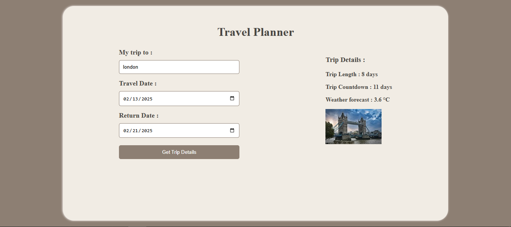

# 🌍 Travel App

### **Author: Dania Abu Ali**

🚀 **Travel Planner** is a web application designed to help users efficiently plan their trips. It provides weather forecasts, trip duration calculations, countdown to departure, and a destination image, making travel planning easy and enjoyable!

## 🛠 **Tech Stack**

- **Languages:** HTML, SCSS, JavaScript
- **Backend:** Node.js, Express.js
- **Build Tools:** Webpack
- **APIs Used:**

  - [🌍 GeoNames API](http://www.geonames.org/)
  - [🌦 Weatherbit API](https://www.weatherbit.io/)
  - [📷 Pixabay API](https://pixabay.com/)

## 🚀 **How to Run the Project**

### **Install Dependencies**

Make sure **Node.js (version 16 or higher)** is installed, then run:

1. Install dependencies:
 
bash
    npm install

2. Run Development Mode
 
bash
    npm run dev
  
3. Start the Server
bash
   npm start

4. Build for Production
bash
   npm run prod

 ### **Travel App Preview**
 
